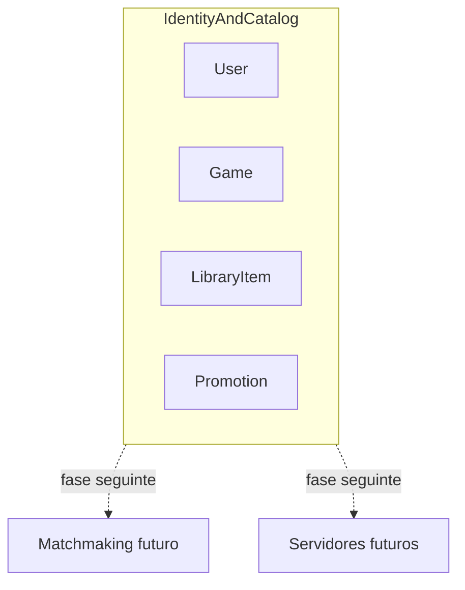
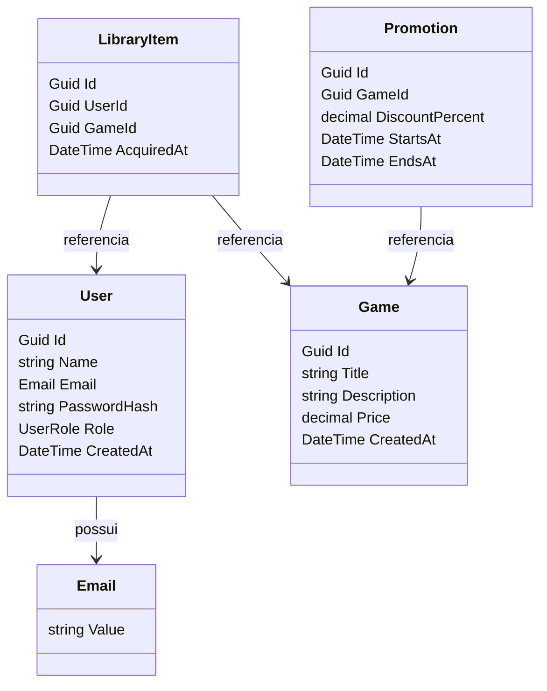

# Contexto e agregados — DDD FCG

## Context Map (MVP)

No MVP há um único bounded context monolítico. Matchmaking e servidores ficam fora do escopo desta fase.

## Diagrama de agregados

## Domain Storytelling (resumo)

1. Um aluno se cadastra com nome, e-mail e senha segura e recebe um JWT de **User**.
2. Um **Admin** autentica e cadastra jogos no catálogo.
3. O aluno lista jogos e adquire um título; o item entra na biblioteca.
4. O Admin cria uma promoção com desconto e período de vigência.
