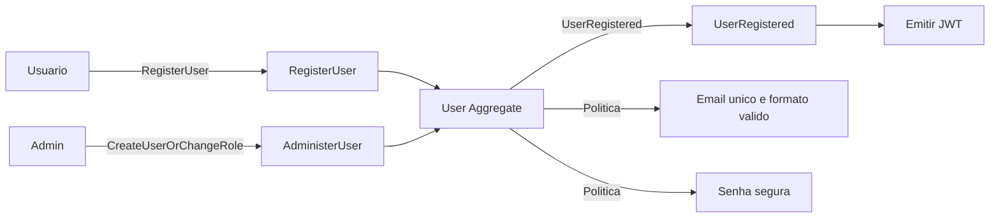
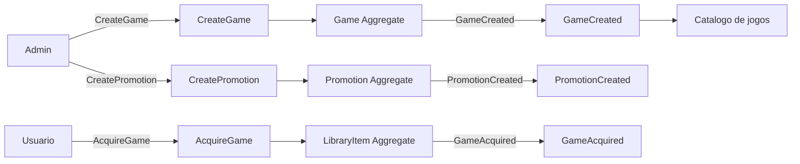

# Event Storming — FCG Fase 1

Bounded context único do MVP: **IdentityAndCatalog** (usuários, jogos, biblioteca e promoções).

## Fluxo: Criação de usuários

**Comandos:** `RegisterUser`, `LoginUser`, `UpdateUser`, `DeleteUser`  
**Agregado:** `User` (Name, Email, PasswordHash, Role)  
**Eventos:** `UserRegistered`  
**Regras:** e-mail válido/único; senha ≥ 8 com letras, números e especial; papéis User | Admin.

## Fluxo: Criação de jogos

**Comandos:** `CreateGame`, `UpdateGame`, `DeleteGame`, `AcquireGame`, `CreatePromotion`  
**Agregados:** `Game`, `LibraryItem`, `Promotion`  
**Eventos:** `GameCreated`, `GameAcquired`, `PromotionCreated`  
**Regras:** só Admin cria/edita jogos e promoções; User adquire jogos na própria biblioteca; preço ≥ 0; desconto 0–100%.
